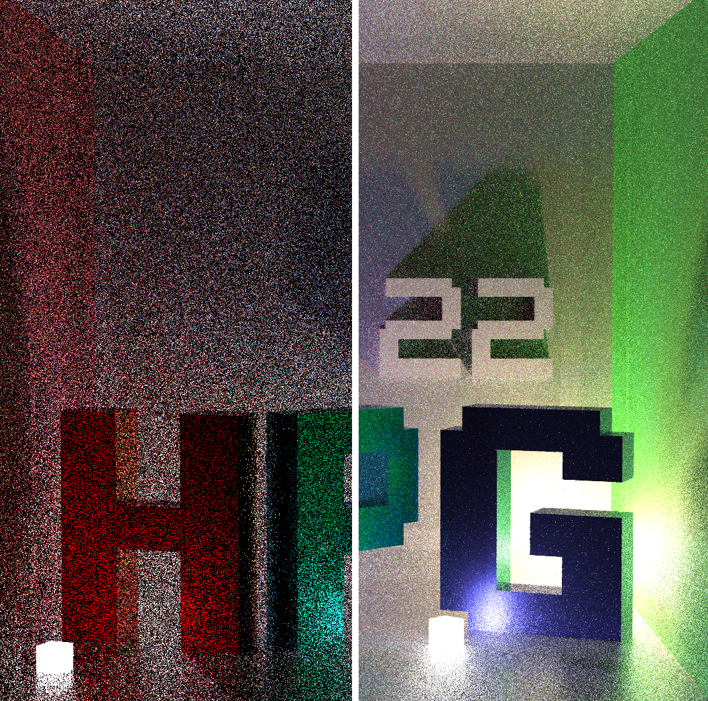

# HPG 2022 - Student Competition
HPG provided an implementation of a raytracer on shadertoy.
The goal was to achieve the highest possible quality compared to a brute-force reference (100k samples per pixel) without a significant performance cost.
In other words, submissions might increase the render time at most by a factor of 2, but would be ranked according to their image quality as measured using [FLIP](https://github.com/NVlabs/flip).

<figure>
  

    
  

  <figcaption style="text-align:center"><b><a href="https://www.shadertoy.com/view/ftXyD2">Left</a>: </b>FLIP score - 0.42, <b><a href="https://www.shadertoy.com/view/sl3yD2">Right: </a></b>FLIP score - 0.19</figcaption>
</figure>

## Improvements
- While choosing which light to sample, we only choose lights which are on the correct side of the shading point, i.e. dot(cube_pos.xyz – shade_point, normal) > 0.
- We choose the light to be sampled with a probability proportional to $\frac{I}{r^2}$.
- While choosing the face from which to sample, we check in which octant the shading point lies in w.r.t to the light cubes coordinate frame. We only sample from the 3 surface which are visible from the shading point.
- We sample from the BRDF using the VNDF technique described in https://jcgt.org/published/0007/04/01/.
- We perform intersection tests in two stages, first, we intersect with bounding boxes surrounding the letters and if the intersection is successful then we perform the intersection with individual components.
- We apply Russian Roulette to terminate paths which won’t contribute much to the final image early.
- We use more samples for Next Event Estimation, i.e. from each point we cast 2 light rays instead of 1.
- We use the blue noise texture to generate random numbers as it is more efficient and distributes the error better.
- We focused on keeping the renderer unbiased.

We achieved a FLIP score of 0.19 against the ground truth that we computed ourselves by converting to the given raytracer to a [progressive ray tracer](https://www.shadertoy.com/view/7dtfz8).

## Contributers
<table>
  <tr>
    <td align="center"><a href="https://ishaanshah.github.io"> <b>Ishaan Shah</b></a></td>
    <td align="center"><a href="https://rahul-goel.github.io"> <b>Rahul Goel</b></a></td>
    <td align="center"><a href="https://coreqode.github.io"> <b>Chandradeep Pokhariya</b></a></td>
  </tr>
</table>
